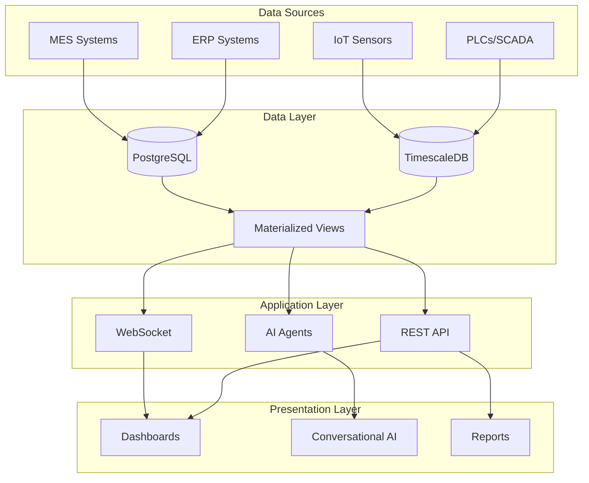
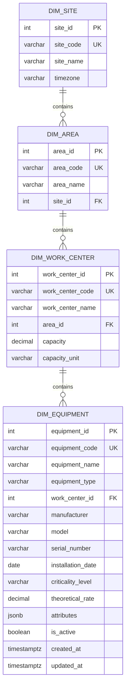
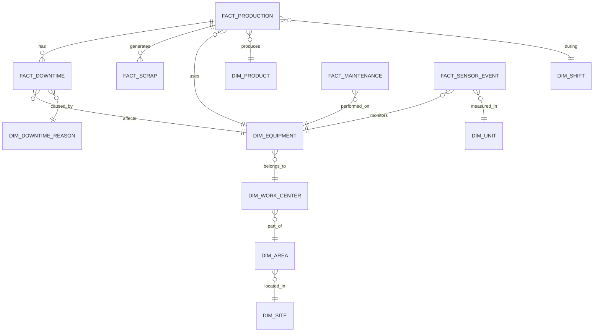

# Manufacturing Analytics Platform - Complete Schema Documentation

## Table of Contents
1. [Executive Summary](#executive-summary)
2. [Architecture Overview](#architecture-overview)
3. [Database Design Principles](#database-design-principles)
4. [Schema Structure](#schema-structure)
5. [Dimensional Models](#dimensional-models)
6. [Fact Tables](#fact-tables)
7. [Materialized Views](#materialized-views)
8. [Data Relationships](#data-relationships)
9. [Query Patterns](#query-patterns)
10. [Performance Optimization](#performance-optimization)
11. [Data Governance](#data-governance)
12. [API Integration](#api-integration)
13. [Migration Guide](#migration-guide)

---

## Executive Summary

This document provides a comprehensive guide to the Manufacturing Analytics Platform's database schema, designed for ISO 22400 (OEE), ISO 9001 (Quality Management), and ISO 14224 (Reliability & Maintenance) compliance. The schema leverages TimescaleDB for time-series optimization while maintaining PostgreSQL compatibility.

### Key Features
- **Star Schema Design**: Optimized for analytical queries
- **Time-Series Optimization**: Leveraging TimescaleDB hypertables
- **ISO Compliance**: Built-in support for international manufacturing standards
- **Real-Time Analytics**: Sub-second query performance for operational dashboards
- **Data Integrity**: Comprehensive foreign key constraints and audit trails

---

## Architecture Overview



### Database Technology Stack
- **Primary Database**: PostgreSQL 14+ with TimescaleDB 2.x extension
- **ORM**: Prisma 5.x for type-safe database access
- **Connection Pooling**: PgBouncer for production deployments
- **Monitoring**: pg_stat_statements, TimescaleDB continuous aggregates

---

## Database Design Principles

### 1. Dimensional Modeling (Star Schema)
The schema follows Ralph Kimball's dimensional modeling methodology:
- **Fact Tables**: Store measurable events (production, downtime, maintenance)
- **Dimension Tables**: Store descriptive attributes (equipment, products, reasons)
- **Slowly Changing Dimensions**: Type 2 SCD for equipment and product changes

### 2. Time-Series Optimization
```sql
-- Example: Fact tables are partitioned by time
SELECT create_hypertable('fact_sensor_event', 'event_ts', 
    chunk_time_interval => INTERVAL '1 day',
    if_not_exists => TRUE
);

-- Compression policy for historical data
ALTER TABLE fact_sensor_event SET (
    timescaledb.compress,
    timescaledb.compress_segmentby = 'equipment_id',
    timescaledb.compress_orderby = 'event_ts DESC'
);
```

### 3. Normalization Strategy
- **3NF for Dimensions**: Minimize redundancy in reference data
- **Denormalized Facts**: Optimize for query performance
- **Calculated Metrics**: Stored in materialized views

---

## Schema Structure

### Naming Conventions
| Pattern | Description | Example |
|---------|-------------|---------|
| `dim_*` | Dimension tables | `dim_equipment` |
| `fact_*` | Fact tables | `fact_production` |
| `view_*` | Materialized views | `view_oee_daily` |
| `*_id` | Primary keys | `equipment_id` |
| `*_code` | Business keys | `equipment_code` |

### Data Types
```typescript
// TypeScript types matching database schema
interface Equipment {
  id: number;              // SERIAL PRIMARY KEY
  code: string;           // VARCHAR(50) UNIQUE
  name: string;           // VARCHAR(200)
  theoreticalRate: Decimal; // DECIMAL(10,2)
  attributes: JsonValue;   // JSONB
  createdAt: Date;        // TIMESTAMPTZ
}
```

---

## Dimensional Models

### 1. Site Hierarchy


### 2. Equipment Dimension (dim_equipment)
```sql
-- Table Definition
CREATE TABLE dim_equipment (
    equipment_id SERIAL PRIMARY KEY,
    equipment_code VARCHAR(50) UNIQUE NOT NULL,
    equipment_name VARCHAR(200) NOT NULL,
    equipment_type VARCHAR(50),
    work_center_id INTEGER NOT NULL REFERENCES dim_work_center(work_center_id),
    manufacturer VARCHAR(100),
    model VARCHAR(100),
    serial_number VARCHAR(100),
    installation_date DATE,
    criticality_level VARCHAR(20) CHECK (criticality_level IN ('Critical', 'High', 'Medium', 'Low')),
    theoretical_rate DECIMAL(10,2), -- parts per hour
    attributes JSONB, -- flexible attributes
    is_active BOOLEAN DEFAULT true,
    created_at TIMESTAMPTZ DEFAULT CURRENT_TIMESTAMP,
    updated_at TIMESTAMPTZ DEFAULT CURRENT_TIMESTAMP
);

-- Indexes for performance
CREATE INDEX idx_equipment_work_center ON dim_equipment(work_center_id, is_active);
CREATE INDEX idx_equipment_attributes ON dim_equipment USING GIN(attributes);

-- Example attributes JSON structure
{
    "maintenance_interval": "30 days",
    "last_calibration": "2025-01-01",
    "energy_consumption": {
        "idle": 5.2,
        "operating": 45.8,
        "unit": "kW"
    },
    "capabilities": ["drilling", "milling", "threading"],
    "tool_capacity": 24
}
```

### 3. Product Dimension (dim_product)
```sql
CREATE TABLE dim_product (
    product_id SERIAL PRIMARY KEY,
    product_code VARCHAR(50) UNIQUE NOT NULL,
    product_name VARCHAR(200) NOT NULL,
    product_family VARCHAR(100),
    unit_of_measure VARCHAR(20) DEFAULT 'EA',
    standard_cost DECIMAL(12,4),
    target_cycle_time BIGINT -- milliseconds
);

-- Common query pattern
SELECT 
    p.product_code,
    p.product_name,
    p.target_cycle_time / 1000.0 AS target_cycle_seconds
FROM dim_product p
WHERE p.product_family = 'Automotive Parts';
```

### 4. Downtime Reasons (dim_downtime_reason)
```sql
CREATE TABLE dim_downtime_reason (
    reason_id SERIAL PRIMARY KEY,
    reason_code VARCHAR(50) UNIQUE NOT NULL,
    reason_description VARCHAR(200) NOT NULL,
    reason_category VARCHAR(50) NOT NULL,
    is_planned BOOLEAN DEFAULT false,
    affects_oee BOOLEAN DEFAULT true,
    is_failure BOOLEAN DEFAULT false -- ISO 14224 compliance
);

-- Standard categories aligned with SEMI E10
INSERT INTO dim_downtime_reason (reason_code, reason_description, reason_category, is_planned, affects_oee, is_failure) VALUES
('SCHED_MAINT', 'Scheduled Maintenance', 'Scheduled Downtime', true, false, false),
('TOOL_CHANGE', 'Tool Change', 'Scheduled Downtime', true, true, false),
('MECH_FAIL', 'Mechanical Failure', 'Unscheduled Downtime', false, true, true),
('ELEC_FAIL', 'Electrical Failure', 'Unscheduled Downtime', false, true, true),
('MAT_SHORT', 'Material Shortage', 'External Downtime', false, true, false),
('NO_OPER', 'No Operator', 'External Downtime', false, true, false);
```

---

## Fact Tables

### 1. Production Facts (fact_production)
Core transactional data for OEE calculation:

```sql
CREATE TABLE fact_production (
    production_id SERIAL PRIMARY KEY,
    date_id INTEGER NOT NULL,
    shift_id INTEGER NOT NULL REFERENCES dim_shift(shift_id),
    equipment_id INTEGER NOT NULL REFERENCES dim_equipment(equipment_id),
    product_id INTEGER NOT NULL REFERENCES dim_product(product_id),
    order_number VARCHAR(50),
    start_time TIMESTAMPTZ NOT NULL,
    end_time TIMESTAMPTZ NOT NULL,
    planned_production_time BIGINT NOT NULL, -- milliseconds
    operating_time BIGINT NOT NULL, -- milliseconds
    planned_parts INTEGER NOT NULL,
    total_parts_produced INTEGER NOT NULL,
    good_parts INTEGER NOT NULL,
    scrap_parts INTEGER DEFAULT 0,
    rework_parts INTEGER DEFAULT 0,
    operator_id VARCHAR(50),
    created_at TIMESTAMPTZ DEFAULT CURRENT_TIMESTAMP,
    
    CONSTRAINT chk_parts CHECK (good_parts <= total_parts_produced),
    CONSTRAINT chk_times CHECK (end_time > start_time)
);

-- Time-based partitioning
CREATE INDEX idx_production_time ON fact_production USING BRIN(start_time);
CREATE INDEX idx_production_equipment_time ON fact_production(equipment_id, start_time DESC);
```

#### OEE Calculation from Production Facts
```sql
-- ISO 22400 compliant OEE calculation
WITH oee_components AS (
    SELECT 
        p.equipment_id,
        p.date_id,
        p.shift_id,
        -- Availability = Operating Time / Planned Production Time
        SUM(p.operating_time)::FLOAT / NULLIF(SUM(p.planned_production_time), 0) AS availability,
        -- Performance = (Total Parts × Ideal Cycle Time) / Operating Time
        SUM(p.total_parts_produced * pr.target_cycle_time)::FLOAT / NULLIF(SUM(p.operating_time), 0) AS performance,
        -- Quality = Good Parts / Total Parts
        SUM(p.good_parts)::FLOAT / NULLIF(SUM(p.total_parts_produced), 0) AS quality
    FROM fact_production p
    JOIN dim_product pr ON p.product_id = pr.product_id
    WHERE p.start_time >= CURRENT_DATE - INTERVAL '7 days'
    GROUP BY p.equipment_id, p.date_id, p.shift_id
)
SELECT 
    equipment_id,
    date_id,
    shift_id,
    ROUND(availability * 100, 2) AS availability_pct,
    ROUND(LEAST(performance, 1.0) * 100, 2) AS performance_pct,
    ROUND(quality * 100, 2) AS quality_pct,
    ROUND(availability * LEAST(performance, 1.0) * quality * 100, 2) AS oee_pct
FROM oee_components;
```

### 2. Downtime Facts (fact_downtime)
```sql
CREATE TABLE fact_downtime (
    downtime_id SERIAL PRIMARY KEY,
    production_id INTEGER REFERENCES fact_production(production_id),
    equipment_id INTEGER NOT NULL REFERENCES dim_equipment(equipment_id),
    reason_id INTEGER NOT NULL REFERENCES dim_downtime_reason(reason_id),
    start_time TIMESTAMPTZ NOT NULL,
    end_time TIMESTAMPTZ NOT NULL,
    downtime_duration BIGINT NOT NULL, -- milliseconds
    comments TEXT,
    created_at TIMESTAMPTZ DEFAULT CURRENT_TIMESTAMP
);

-- Example: MTBF/MTTR calculation
WITH failure_analysis AS (
    SELECT 
        e.equipment_id,
        e.equipment_code,
        COUNT(DISTINCT d.downtime_id) AS failure_count,
        SUM(d.downtime_duration) / 3600000.0 AS total_downtime_hours,
        EXTRACT(EPOCH FROM (MAX(d.end_time) - MIN(d.start_time))) / 3600.0 AS total_calendar_hours
    FROM dim_equipment e
    LEFT JOIN fact_downtime d ON e.equipment_id = d.equipment_id
    LEFT JOIN dim_downtime_reason dr ON d.reason_id = dr.reason_id
    WHERE dr.is_failure = true
        AND d.start_time >= CURRENT_DATE - INTERVAL '30 days'
    GROUP BY e.equipment_id, e.equipment_code
)
SELECT 
    equipment_code,
    failure_count,
    ROUND(total_downtime_hours, 2) AS total_downtime_hours,
    ROUND(total_calendar_hours / NULLIF(failure_count, 0), 2) AS mtbf_hours,
    ROUND(total_downtime_hours / NULLIF(failure_count, 0), 2) AS mttr_hours
FROM failure_analysis
ORDER BY mtbf_hours ASC NULLS LAST;
```

### 3. Maintenance Facts (fact_maintenance)
```sql
CREATE TABLE fact_maintenance (
    maintenance_id SERIAL PRIMARY KEY,
    equipment_id INTEGER NOT NULL REFERENCES dim_equipment(equipment_id),
    work_order_number VARCHAR(50) NOT NULL,
    maintenance_type VARCHAR(50) NOT NULL,
    start_time TIMESTAMPTZ NOT NULL,
    end_time TIMESTAMPTZ NOT NULL,
    labor_hours DECIMAL(10,2),
    material_cost DECIMAL(12,2),
    description TEXT,
    created_at TIMESTAMPTZ DEFAULT CURRENT_TIMESTAMP,
    
    CONSTRAINT chk_maintenance_type CHECK (maintenance_type IN ('Preventive', 'Corrective', 'Predictive', 'Calibration'))
);

-- Maintenance cost analysis
SELECT 
    e.equipment_code,
    e.equipment_name,
    COUNT(m.maintenance_id) AS maintenance_count,
    SUM(m.labor_hours) AS total_labor_hours,
    SUM(m.material_cost) AS total_material_cost,
    AVG(EXTRACT(EPOCH FROM (m.end_time - m.start_time)) / 3600.0) AS avg_duration_hours
FROM dim_equipment e
JOIN fact_maintenance m ON e.equipment_id = m.equipment_id
WHERE m.start_time >= CURRENT_DATE - INTERVAL '90 days'
GROUP BY e.equipment_code, e.equipment_name
ORDER BY total_material_cost DESC;
```

### 4. Sensor Events (fact_sensor_event)
Time-series data optimized with TimescaleDB:

```sql
-- Partitioned hypertable for high-frequency sensor data
CREATE TABLE fact_sensor_event (
    event_id BIGSERIAL,
    equipment_id INTEGER NOT NULL REFERENCES dim_equipment(equipment_id),
    event_ts TIMESTAMPTZ NOT NULL,
    parameter VARCHAR(100) NOT NULL,
    value DECIMAL(20,6) NOT NULL,
    unit_id INTEGER REFERENCES dim_unit(unit_id),
    PRIMARY KEY (event_id, event_ts)
) PARTITION BY RANGE (event_ts);

-- Convert to hypertable
SELECT create_hypertable('fact_sensor_event', 'event_ts');

-- Create continuous aggregate for 5-minute averages
CREATE MATERIALIZED VIEW sensor_5min_avg
WITH (timescaledb.continuous) AS
SELECT 
    time_bucket('5 minutes', event_ts) AS bucket,
    equipment_id,
    parameter,
    AVG(value) AS avg_value,
    MIN(value) AS min_value,
    MAX(value) AS max_value,
    COUNT(*) AS sample_count
FROM fact_sensor_event
GROUP BY bucket, equipment_id, parameter
WITH NO DATA;

-- Refresh policy
SELECT add_continuous_aggregate_policy('sensor_5min_avg',
    start_offset => INTERVAL '1 hour',
    end_offset => INTERVAL '5 minutes',
    schedule_interval => INTERVAL '5 minutes');
```

---

## Materialized Views

### 1. Daily OEE View (view_oee_daily)
Pre-calculated OEE metrics for dashboard performance:

```sql
CREATE MATERIALIZED VIEW view_oee_daily AS
WITH production_summary AS (
    SELECT 
        DATE(p.start_time) AS date_id,
        p.shift_id,
        p.equipment_id,
        SUM(p.operating_time) AS total_operating_time,
        SUM(p.planned_production_time) AS total_planned_time,
        SUM(p.total_parts_produced) AS total_parts,
        SUM(p.good_parts) AS good_parts,
        SUM(p.total_parts_produced * pr.target_cycle_time) AS total_theoretical_time
    FROM fact_production p
    JOIN dim_product pr ON p.product_id = pr.product_id
    GROUP BY DATE(p.start_time), p.shift_id, p.equipment_id
)
SELECT 
    date_id,
    shift_id,
    equipment_id,
    LEAST(total_operating_time::FLOAT / NULLIF(total_planned_time, 0), 1.0) AS availability,
    LEAST(total_theoretical_time::FLOAT / NULLIF(total_operating_time, 0), 1.0) AS performance,
    good_parts::FLOAT / NULLIF(total_parts, 0) AS quality,
    LEAST(total_operating_time::FLOAT / NULLIF(total_planned_time, 0), 1.0) *
    LEAST(total_theoretical_time::FLOAT / NULLIF(total_operating_time, 0), 1.0) *
    (good_parts::FLOAT / NULLIF(total_parts, 0)) AS oee
FROM production_summary;

-- Index for fast lookups
CREATE UNIQUE INDEX idx_oee_daily_pk ON view_oee_daily(date_id, shift_id, equipment_id);

-- Refresh schedule
CREATE OR REPLACE FUNCTION refresh_oee_daily()
RETURNS void AS $$
BEGIN
    REFRESH MATERIALIZED VIEW CONCURRENTLY view_oee_daily;
END;
$$ LANGUAGE plpgsql;

-- Schedule with pg_cron
SELECT cron.schedule('refresh-oee-daily', '0 */1 * * *', 'SELECT refresh_oee_daily();');
```

### 2. Equipment Reliability View (view_reliability_summary)
```sql
CREATE MATERIALIZED VIEW view_reliability_summary AS
WITH equipment_failures AS (
    SELECT 
        e.equipment_id,
        e.equipment_code,
        e.equipment_name,
        COUNT(DISTINCT d.downtime_id) AS failure_count,
        SUM(d.downtime_duration) / 3600000.0 AS total_failure_hours
    FROM dim_equipment e
    LEFT JOIN fact_downtime d ON e.equipment_id = d.equipment_id
    LEFT JOIN dim_downtime_reason dr ON d.reason_id = dr.reason_id
    WHERE dr.is_failure = true
        AND d.start_time >= CURRENT_DATE - INTERVAL '90 days'
    GROUP BY e.equipment_id, e.equipment_code, e.equipment_name
),
equipment_runtime AS (
    SELECT 
        equipment_id,
        SUM(operating_time) / 3600000.0 AS total_operating_hours
    FROM fact_production
    WHERE start_time >= CURRENT_DATE - INTERVAL '90 days'
    GROUP BY equipment_id
)
SELECT 
    ef.equipment_id,
    ef.equipment_code,
    ef.equipment_name,
    COALESCE(er.total_operating_hours / NULLIF(ef.failure_count, 0), 0) AS mtbf_hours,
    COALESCE(ef.total_failure_hours / NULLIF(ef.failure_count, 0), 0) AS mttr_hours,
    ef.failure_count
FROM equipment_failures ef
LEFT JOIN equipment_runtime er ON ef.equipment_id = er.equipment_id;
```

---

## Data Relationships

### Entity Relationship Diagram


### Key Relationships

1. **Production Cascade**
   ```sql
   -- Production triggers downtime and scrap records
   fact_production → fact_downtime (1:many)
   fact_production → fact_scrap (1:many)
   ```

2. **Equipment Hierarchy**
   ```sql
   -- Site → Area → Work Center → Equipment
   dim_site → dim_area → dim_work_center → dim_equipment
   ```

3. **Temporal Relationships**
   ```sql
   -- All facts relate to time dimensions
   fact_* → dim_date_range (for aggregations)
   fact_production → dim_shift (for shift analysis)
   ```

---

## Query Patterns

### 1. Real-Time OEE Dashboard
```sql
-- Current shift OEE with 5-minute updates
WITH current_shift AS (
    SELECT 
        shift_id,
        site_id,
        shift_name,
        CURRENT_TIME::TIME BETWEEN start_time::TIME AND end_time::TIME AS is_current
    FROM dim_shift
    WHERE is_active = true
    ORDER BY is_current DESC
    LIMIT 1
),
live_oee AS (
    SELECT 
        e.equipment_code,
        e.equipment_name,
        ROUND(AVG(v.availability) * 100, 1) AS availability,
        ROUND(AVG(v.performance) * 100, 1) AS performance,
        ROUND(AVG(v.quality) * 100, 1) AS quality,
        ROUND(AVG(v.oee) * 100, 1) AS oee,
        MAX(p.end_time) AS last_update
    FROM view_oee_daily v
    JOIN dim_equipment e ON v.equipment_id = e.equipment_id
    JOIN fact_production p ON p.equipment_id = e.equipment_id
    CROSS JOIN current_shift cs
    WHERE v.date_id = CURRENT_DATE
        AND v.shift_id = cs.shift_id
        AND p.start_time >= CURRENT_TIMESTAMP - INTERVAL '1 hour'
    GROUP BY e.equipment_code, e.equipment_name
)
SELECT * FROM live_oee
ORDER BY oee ASC;
```

### 2. Pareto Analysis for Downtime
```sql
-- Top 10 downtime reasons (80/20 rule)
WITH downtime_summary AS (
    SELECT 
        dr.reason_code,
        dr.reason_description,
        dr.reason_category,
        COUNT(DISTINCT d.downtime_id) AS occurrence_count,
        SUM(d.downtime_duration) / 3600000.0 AS total_hours,
        SUM(d.downtime_duration) / 3600000.0 / COUNT(DISTINCT d.equipment_id) AS avg_hours_per_equipment
    FROM fact_downtime d
    JOIN dim_downtime_reason dr ON d.reason_id = dr.reason_id
    WHERE d.start_time >= CURRENT_DATE - INTERVAL '30 days'
        AND dr.affects_oee = true
    GROUP BY dr.reason_code, dr.reason_description, dr.reason_category
),
ranked_downtime AS (
    SELECT 
        *,
        SUM(total_hours) OVER (ORDER BY total_hours DESC) AS cumulative_hours,
        SUM(total_hours) OVER () AS grand_total_hours
    FROM downtime_summary
)
SELECT 
    reason_code,
    reason_description,
    reason_category,
    occurrence_count,
    ROUND(total_hours, 2) AS total_hours,
    ROUND(avg_hours_per_equipment, 2) AS avg_hours_per_equipment,
    ROUND(100.0 * total_hours / grand_total_hours, 1) AS percentage,
    ROUND(100.0 * cumulative_hours / grand_total_hours, 1) AS cumulative_percentage
FROM ranked_downtime
WHERE cumulative_hours / grand_total_hours <= 0.8 -- Top 80%
ORDER BY total_hours DESC;
```

### 3. Predictive Maintenance Insights
```sql
-- Equipment approaching maintenance threshold
WITH sensor_trends AS (
    SELECT 
        s.equipment_id,
        s.parameter,
        AVG(s.avg_value) AS current_avg,
        STDDEV(s.avg_value) AS current_stddev,
        regr_slope(s.avg_value, EXTRACT(EPOCH FROM s.bucket)) AS trend_slope
    FROM sensor_5min_avg s
    WHERE s.bucket >= CURRENT_TIMESTAMP - INTERVAL '24 hours'
        AND s.parameter IN ('vibration', 'temperature', 'current')
    GROUP BY s.equipment_id, s.parameter
),
maintenance_predictions AS (
    SELECT 
        e.equipment_code,
        e.equipment_name,
        st.parameter,
        st.current_avg,
        st.trend_slope,
        CASE 
            WHEN st.parameter = 'vibration' AND st.current_avg > 4.5 THEN 'CRITICAL'
            WHEN st.parameter = 'temperature' AND st.current_avg > 85 THEN 'CRITICAL'
            WHEN st.parameter = 'vibration' AND st.current_avg > 3.5 THEN 'WARNING'
            WHEN st.parameter = 'temperature' AND st.current_avg > 75 THEN 'WARNING'
            ELSE 'NORMAL'
        END AS alert_level,
        CASE 
            WHEN st.trend_slope > 0 THEN 
                ROUND((CASE 
                    WHEN st.parameter = 'vibration' THEN (5.0 - st.current_avg)
                    WHEN st.parameter = 'temperature' THEN (90.0 - st.current_avg)
                END) / NULLIF(st.trend_slope * 86400, 0), 0)
            ELSE NULL
        END AS days_to_threshold
    FROM sensor_trends st
    JOIN dim_equipment e ON st.equipment_id = e.equipment_id
)
SELECT 
    equipment_code,
    equipment_name,
    parameter,
    ROUND(current_avg, 2) AS current_value,
    alert_level,
    days_to_threshold
FROM maintenance_predictions
WHERE alert_level IN ('WARNING', 'CRITICAL')
ORDER BY alert_level DESC, days_to_threshold ASC NULLS LAST;
```

### 4. Quality Analysis with Scrap Tracking
```sql
-- Scrap analysis by product and equipment
WITH scrap_analysis AS (
    SELECT 
        e.equipment_code,
        p.product_code,
        p.product_name,
        COUNT(DISTINCT s.scrap_id) AS scrap_incidents,
        SUM(s.scrap_qty) AS total_scrap_qty,
        SUM(s.scrap_cost) AS total_scrap_cost,
        STRING_AGG(DISTINCT s.scrap_code, ', ') AS scrap_codes
    FROM fact_scrap s
    JOIN fact_production fp ON s.production_id = fp.production_id
    JOIN dim_equipment e ON fp.equipment_id = e.equipment_id
    JOIN dim_product p ON s.product_id = p.product_id
    WHERE fp.start_time >= CURRENT_DATE - INTERVAL '7 days'
    GROUP BY e.equipment_code, p.product_code, p.product_name
),
production_volume AS (
    SELECT 
        e.equipment_code,
        p.product_code,
        SUM(fp.total_parts_produced) AS total_produced
    FROM fact_production fp
    JOIN dim_equipment e ON fp.equipment_id = e.equipment_id
    JOIN dim_product p ON fp.product_id = p.product_id
    WHERE fp.start_time >= CURRENT_DATE - INTERVAL '7 days'
    GROUP BY e.equipment_code, p.product_code
)
SELECT 
    sa.equipment_code,
    sa.product_code,
    sa.product_name,
    sa.scrap_incidents,
    sa.total_scrap_qty,
    pv.total_produced,
    ROUND(100.0 * sa.total_scrap_qty / NULLIF(pv.total_produced, 0), 2) AS scrap_rate_pct,
    sa.total_scrap_cost,
    sa.scrap_codes
FROM scrap_analysis sa
JOIN production_volume pv ON sa.equipment_code = pv.equipment_code 
    AND sa.product_code = pv.product_code
ORDER BY scrap_rate_pct DESC;
```

---

## Performance Optimization

### 1. Index Strategy
```sql
-- Primary indexes (automatically created)
-- PRIMARY KEY creates unique B-tree index
-- FOREIGN KEY creates B-tree index on referencing column

-- Time-based queries (BRIN for append-only data)
CREATE INDEX idx_production_time_brin ON fact_production USING BRIN(start_time);
CREATE INDEX idx_downtime_time_brin ON fact_downtime USING BRIN(start_time);
CREATE INDEX idx_sensor_time_brin ON fact_sensor_event USING BRIN(event_ts);

-- Composite indexes for common access patterns
CREATE INDEX idx_production_equipment_time ON fact_production(equipment_id, start_time DESC);
CREATE INDEX idx_downtime_equipment_time ON fact_downtime(equipment_id, start_time DESC);
CREATE INDEX idx_sensor_equipment_param_time ON fact_sensor_event(equipment_id, parameter, event_ts DESC);

-- JSON indexes for flexible queries
CREATE INDEX idx_equipment_attributes ON dim_equipment USING GIN(attributes);
CREATE INDEX idx_audit_before_data ON audit_log USING GIN(before_data);
CREATE INDEX idx_audit_after_data ON audit_log USING GIN(after_data);

-- Partial indexes for filtered queries
CREATE INDEX idx_active_equipment ON dim_equipment(work_center_id) WHERE is_active = true;
CREATE INDEX idx_unplanned_downtime ON fact_downtime(equipment_id, start_time) 
    WHERE reason_id IN (SELECT reason_id FROM dim_downtime_reason WHERE is_planned = false);
```

### 2. Partitioning Strategy
```sql
-- Range partitioning for time-series data
-- fact_sensor_event partitioned by month
CREATE TABLE fact_sensor_event_2025_01 PARTITION OF fact_sensor_event
    FOR VALUES FROM ('2025-01-01') TO ('2025-02-01');

-- Automated partition management
CREATE OR REPLACE FUNCTION create_monthly_partitions()
RETURNS void AS $$
DECLARE
    start_date date;
    end_date date;
    partition_name text;
BEGIN
    start_date := DATE_TRUNC('month', CURRENT_DATE);
    FOR i IN 0..11 LOOP
        end_date := start_date + INTERVAL '1 month';
        partition_name := 'fact_sensor_event_' || TO_CHAR(start_date, 'YYYY_MM');
        
        EXECUTE format('CREATE TABLE IF NOT EXISTS %I PARTITION OF fact_sensor_event 
                        FOR VALUES FROM (%L) TO (%L)',
                        partition_name, start_date, end_date);
        
        start_date := end_date;
    END LOOP;
END;
$$ LANGUAGE plpgsql;

-- Schedule monthly
SELECT cron.schedule('create-partitions', '0 0 1 * *', 'SELECT create_monthly_partitions();');
```

### 3. Query Optimization Tips
```sql
-- Use CTEs for complex queries
WITH equipment_metrics AS (
    -- Pre-calculate expensive operations
    SELECT ... FROM fact_production WHERE ...
)
SELECT * FROM equipment_metrics;

-- Leverage window functions
SELECT 
    equipment_id,
    oee,
    LAG(oee) OVER (PARTITION BY equipment_id ORDER BY date_id) AS prev_oee,
    oee - LAG(oee) OVER (PARTITION BY equipment_id ORDER BY date_id) AS oee_change
FROM view_oee_daily;

-- Use EXPLAIN ANALYZE for query tuning
EXPLAIN (ANALYZE, BUFFERS) 
SELECT ... FROM fact_production ...;
```

---

## Data Governance

### 1. Audit Trail Implementation
```sql
-- Generic audit trigger function
CREATE OR REPLACE FUNCTION audit_trigger_func()
RETURNS trigger AS $$
BEGIN
    INSERT INTO audit_log (
        username,
        action,
        table_name,
        record_id,
        before_data,
        after_data
    ) VALUES (
        current_user,
        TG_OP,
        TG_TABLE_NAME,
        CASE 
            WHEN TG_OP = 'DELETE' THEN OLD.id::text
            ELSE NEW.id::text
        END,
        CASE 
            WHEN TG_OP IN ('UPDATE', 'DELETE') THEN row_to_json(OLD)
            ELSE NULL
        END,
        CASE 
            WHEN TG_OP IN ('INSERT', 'UPDATE') THEN row_to_json(NEW)
            ELSE NULL
        END
    );
    RETURN NEW;
END;
$$ LANGUAGE plpgsql;

-- Apply to critical tables
CREATE TRIGGER audit_equipment AFTER INSERT OR UPDATE OR DELETE 
ON dim_equipment FOR EACH ROW EXECUTE FUNCTION audit_trigger_func();
```

### 2. Data Retention Policies
```sql
-- Automated data archival
CREATE OR REPLACE FUNCTION archive_old_sensor_data()
RETURNS void AS $$
DECLARE
    archived_count bigint;
BEGIN
    -- Move data older than 1 year to archive table
    WITH moved AS (
        DELETE FROM fact_sensor_event
        WHERE event_ts < CURRENT_DATE - INTERVAL '1 year'
        RETURNING *
    )
    INSERT INTO fact_sensor_event_archive
    SELECT * FROM moved;
    
    GET DIAGNOSTICS archived_count = ROW_COUNT;
    
    -- Log archival
    INSERT INTO system_metrics (metric_type, metric_name, metric_value)
    VALUES ('data_archival', 'sensor_events_archived', archived_count);
END;
$$ LANGUAGE plpgsql;
```

### 3. Data Quality Checks
```sql
-- Automated quality validation
CREATE OR REPLACE FUNCTION check_data_quality()
RETURNS TABLE(
    check_name text,
    table_name text,
    passed boolean,
    details jsonb
) AS $$
BEGIN
    -- Check 1: OEE values within valid range
    RETURN QUERY
    SELECT 
        'oee_range_check'::text,
        'view_oee_daily'::text,
        NOT EXISTS(SELECT 1 FROM view_oee_daily WHERE oee < 0 OR oee > 1),
        jsonb_build_object(
            'invalid_count', COUNT(*),
            'sample_records', jsonb_agg(row_to_json(t.*))
        )
    FROM (
        SELECT * FROM view_oee_daily 
        WHERE oee < 0 OR oee > 1 
        LIMIT 5
    ) t;
    
    -- Check 2: Referential integrity
    RETURN QUERY
    SELECT 
        'orphaned_production_records'::text,
        'fact_production'::text,
        NOT EXISTS(
            SELECT 1 FROM fact_production p
            LEFT JOIN dim_equipment e ON p.equipment_id = e.equipment_id
            WHERE e.equipment_id IS NULL
        ),
        jsonb_build_object(
            'orphaned_count', COUNT(*)
        )
    FROM fact_production p
    LEFT JOIN dim_equipment e ON p.equipment_id = e.equipment_id
    WHERE e.equipment_id IS NULL;
END;
$$ LANGUAGE plpgsql;
```

---

## API Integration

### 1. Prisma Schema Integration
```typescript
// Example Prisma query for OEE dashboard
const oeeData = await prisma.viewOeeDaily.findMany({
  where: {
    dateId: {
      gte: new Date(Date.now() - 7 * 24 * 60 * 60 * 1000)
    },
    equipmentId: {
      in: equipmentIds
    }
  },
  orderBy: [
    { dateId: 'desc' },
    { shiftId: 'asc' }
  ]
});

// Type-safe aggregation
const summary = await prisma.factProduction.aggregate({
  where: {
    startTime: {
      gte: startDate,
      lte: endDate
    }
  },
  _sum: {
    totalPartsProduced: true,
    goodParts: true,
    scrapParts: true
  },
  _avg: {
    operatingTime: true
  }
});
```

### 2. REST API Endpoints
```typescript
// GET /api/manufacturing-metrics/oee
interface OEEResponse {
  equipment: {
    id: number;
    code: string;
    name: string;
  };
  metrics: {
    availability: number;
    performance: number;
    quality: number;
    oee: number;
  };
  trend: {
    direction: 'up' | 'down' | 'stable';
    change: number;
  };
}

// GET /api/manufacturing-metrics/production
interface ProductionResponse {
  dateRange: {
    start: string;
    end: string;
  };
  summary: {
    totalParts: number;
    goodParts: number;
    scrapParts: number;
    efficiency: number;
  };
  byEquipment: Array<{
    equipmentId: number;
    equipmentCode: string;
    production: number;
    efficiency: number;
  }>;
}
```

### 3. Real-Time WebSocket Events
```typescript
// WebSocket event structure
interface ManufacturingEvent {
  type: 'production' | 'downtime' | 'quality_alert' | 'maintenance';
  timestamp: string;
  equipmentId: number;
  data: {
    // Event-specific payload
    [key: string]: any;
  };
}

// Example: Real-time OEE update
{
  type: 'production',
  timestamp: '2025-06-25T14:30:00Z',
  equipmentId: 101,
  data: {
    shift: 'Day Shift',
    currentOEE: 0.825,
    availability: 0.92,
    performance: 0.95,
    quality: 0.945,
    partsProduced: 245,
    targetRate: 250
  }
}
```

---

## Migration Guide

### 1. From Legacy Systems
```sql
-- Example: Migrating from flat file structure
-- Step 1: Create staging tables
CREATE TABLE staging_equipment (
    legacy_id varchar(50),
    name varchar(200),
    type varchar(50),
    location varchar(100),
    import_batch uuid DEFAULT gen_random_uuid()
);

-- Step 2: Load and transform data
INSERT INTO dim_equipment (
    equipment_code,
    equipment_name,
    equipment_type,
    work_center_id,
    attributes
)
SELECT 
    s.legacy_id,
    s.name,
    s.type,
    wc.work_center_id,
    jsonb_build_object(
        'legacy_id', s.legacy_id,
        'import_batch', s.import_batch,
        'import_date', CURRENT_DATE
    )
FROM staging_equipment s
JOIN dim_work_center wc ON wc.work_center_name = s.location
ON CONFLICT (equipment_code) DO UPDATE
SET 
    equipment_name = EXCLUDED.equipment_name,
    attributes = dim_equipment.attributes || EXCLUDED.attributes;
```

### 2. Schema Versioning
```sql
-- Track schema versions
CREATE TABLE schema_version (
    version_id SERIAL PRIMARY KEY,
    version_number VARCHAR(20) NOT NULL,
    description TEXT,
    applied_at TIMESTAMPTZ DEFAULT CURRENT_TIMESTAMP,
    applied_by VARCHAR(100) DEFAULT current_user
);

-- Version tracking for migrations
INSERT INTO schema_version (version_number, description) VALUES
('1.0.0', 'Initial ISO-compliant schema'),
('1.1.0', 'Added sensor event partitioning'),
('1.2.0', 'Added continuous aggregates'),
('1.3.0', 'Added audit trail tables');
```

### 3. Rollback Procedures
```sql
-- Backup critical data before migrations
CREATE TABLE dim_equipment_backup_20250625 AS 
SELECT * FROM dim_equipment;

-- Rollback procedure
CREATE OR REPLACE FUNCTION rollback_to_backup(
    table_name text,
    backup_suffix text
) RETURNS void AS $$
BEGIN
    EXECUTE format('TRUNCATE TABLE %I CASCADE', table_name);
    EXECUTE format('INSERT INTO %I SELECT * FROM %I_%s', 
                   table_name, table_name, backup_suffix);
END;
$$ LANGUAGE plpgsql;
```

---

## Best Practices Summary

1. **Always use transactions** for multi-table operations
2. **Implement retry logic** for transient failures
3. **Monitor query performance** with pg_stat_statements
4. **Use connection pooling** (PgBouncer) in production
5. **Regular VACUUM and ANALYZE** for optimal performance
6. **Backup strategy**: Full daily + WAL archiving
7. **Test migrations** in staging environment first
8. **Document all custom functions** and procedures
9. **Use prepared statements** to prevent SQL injection
10. **Monitor disk usage** for time-series data growth

---

## Appendix: Complete SQL Scripts

All DDL scripts, sample data, and maintenance procedures are available in:
- `/scripts/schema/` - Table definitions
- `/scripts/data/` - Sample data generators
- `/scripts/maintenance/` - Automated maintenance tasks
- `/scripts/migration/` - Version migration scripts

For questions or support, contact the Database Architecture team.